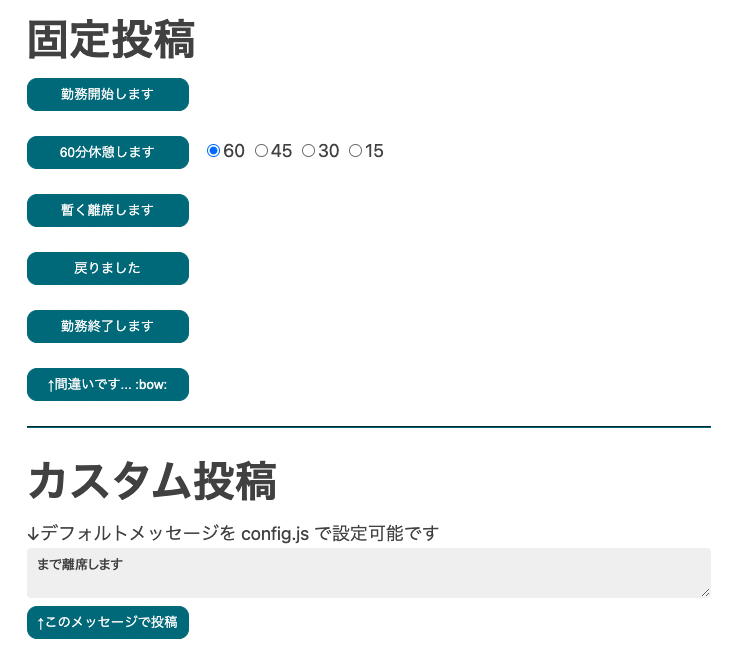

# Slack勤怠ボタン

Button to report attendance to slack
- Supports multiple workspaces and multiple channels.
- Record the time.
- There are only the minimum functions necessary for me.

## Installation

- Clone or Download this repository.
- Copy `config.js.dist` to `config.js`.
- Change parameters in `config.js` as described in the comments.
  - *Highly Recommend* : First, test on your personal test channel. 

Details

- Get `Bot API Token` from Slack.
  - Open https://slack.com/apps/A0F7YS25R-bots
  - push "Add to Slack" button
  - copy `API Token`

- Get thread_ts from message.
  - 
  - 
  - Get `thread_ts` parameter value from query string.

## Usage

1. Open index.html. (Recommended to put in "Favorites" or create an alias on your desktop)
2. Press the button!
